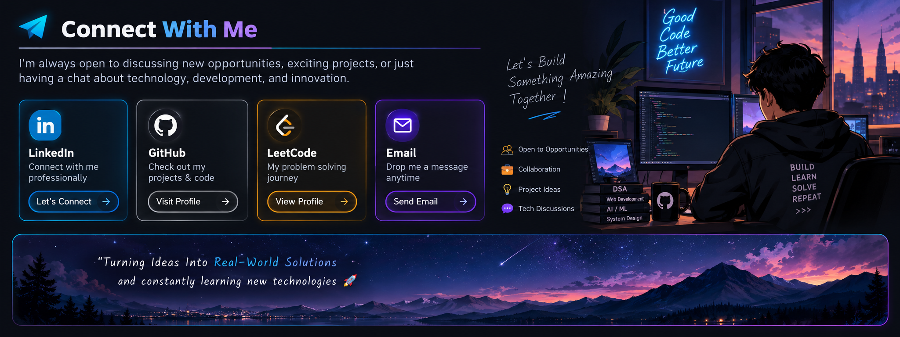

I am Rohit Arabale
### BTech Computer Science Student | Full-Stack Developer | AI/ML Enthusiast | Problem Solver
🎓 I'm a BTech Computer Science student from KITCOEK passionate about building real-world tech solutions.
💻 I enjoy working on Web Development and Artificial Intelligence, combining creativity with logic to solve problems and learning upcoming skills needed in the future market

## 🚀 Executive Summary

- 🎓 BTech Computer Science student at **KITCOEK**
- 💻 Interested in **Full-Stack Web Development**
- 🤖 Exploring **Artificial Intelligence & Machine Learning**
- 🧠 Currently strengthening **Data Structures & Algorithms**
- 🌱 Learning **React, Node.js & Backend Development**
- ☁️ Interested in **Cloud & scalable applications**
- 🧩 Practicing problem solving through **LeetCode**
- 🚀 Building real-world projects and experimenting with new technologies
- 🎯 Goal: Become a strong **Full-Stack Developer + Problem Solver**

## 📊 GitHub Analytics

  
  

  

---

## 🐍 Contribution Activity

  <picture>
    <source
      media="(prefers-color-scheme: dark)"
      srcset="https://raw.githubusercontent.com/rohit-arabale/rohit-arabale/output/github-snake-dark.svg"
    />
    <source
      media="(prefers-color-scheme: light)"
      srcset="https://raw.githubusercontent.com/rohit-arabale/rohit-arabale/output/github-snake.svg"
    />
    
  </picture>

## 🛠️ Tech Stack

### 💻 Languages

### 🌐 Frontend

### ⚙️ Backend

### 🗄️ Database

### 🤖 AI / ML

### 🧠 DSA & CS Fundamentals

### ☁️ Cloud & DevOps

### 🛠️ Tools & Platforms

### 🔐 Security

### 🏗️ Architecture & Engineering

### 📚 Currently Learning / Exploring

## ⭐ Featured Projects

| Project | Description | Technologies |
|---|---|---|
| 🧠 [Roadmap.ai](https://github.com/rohit-arabale/roadmap-ai) | AI-powered personalized learning path and recommendation platform | React, TypeScript, Bun, Express, Prisma, PostgreSQL, Gemini |
| 🚀 [BizFlow](https://github.com/rohit-arabale/bizflow) | Business automation platform for inventory, appointments, orders and WhatsApp | React, Node.js, Express, MongoDB, JWT, Twilio |
| 📱 [Flux Mirror](https://github.com/rohit-arabale/Flux-Mirror) | Android screen mirroring, casting and browser streaming application | Kotlin, Jetpack Compose, Ktor, WebSockets |
| 🎓 [College Ecosystem](https://github.com/rohit-arabale/college-ecosystem) | Full-stack student platform with chat, marketplace, notes and events | React, Node.js, Express, MongoDB, Socket.io |
| 🤖 [AI Study Assistant](https://github.com/rohit-arabale/ai-study-assistant) | AI-powered platform for student learning, notes and intelligent assistance | React, Node.js, Express, MongoDB, OpenRouter |

## 📫 Connect With Me

  

  

  

  

